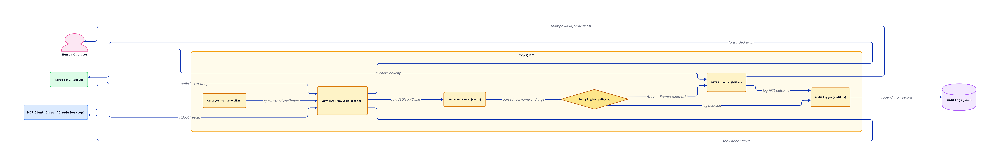
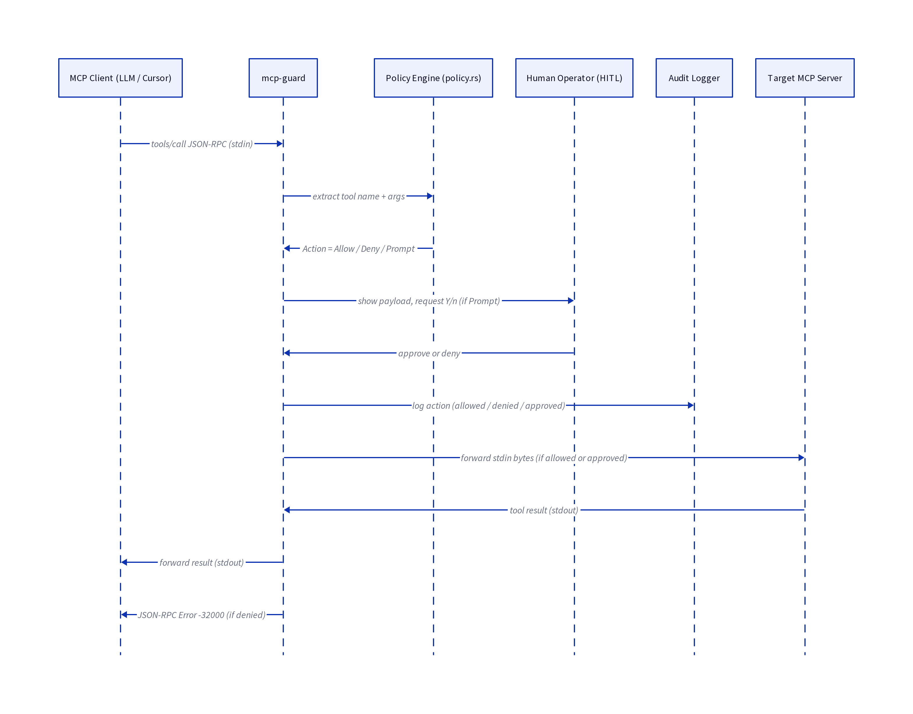

# Architecture & Execution Flow

This document outlines the internal structural components of `mcp-guard` and traces how a standard JSON-RPC tool call navigates through the secure pipeline.

## 1. Internal Components

`mcp-guard` operates as an asynchronous wrapper, bridging standard I/O streams using `tokio`. The data enters from the client, is parsed and evaluated by the internal engine, and is conditionally forwarded.

### Key Modules
*   **CLI Layer** (`cli.rs`/`main.rs`): Parses boot configurations and the target command execution path.
*   **Async Proxy Loop** (`proxy.rs`): Bi-directional bridge connecting the parent process to the target destination natively.
*   **JSON-RPC Parser** (`rpc.rs`): Efficiently decodes byte streams specifically hunting for MCP `tools/call` and `resources/read` payloads.
*   **Policy Engine** (`policy.rs`): Maps tool patterns to `.toml` configurations evaluating `allow`, `deny`, and regex matches.
*   **Audit Logger** (`audit.rs`): Non-blocking, isolated append-only logging of actions.
*   **HITL Prompter** (`hitl.rs`): Safely traps execution requiring interactive user approval.

---

## 2. Tool Call Execution Flow

Once `mcp-guard` intercepts a JSON-RPC payload matching an MCP tool call request, the pipeline evaluates the strict action map. 

1.  **Deny Path:** The tool is either explicitly denied or matches a `deny_patterns` Regex constraint. The request is immediately rejected and `mcp-guard` synthesizes a `-32000` JSON error straight back to the client.
2.  **Prompt Path:** The tool triggers a `prompt`. The pipeline pauses standard propagation, locking the terminal to enforce an interactive query from the operator.
    *   If denied by the human, it mirrors the *Deny Path*.
3.  **Allow Path:** The tool is organically allowed (or explicitly approved by a human), the execution context unlocks and pushes the binary blob downstream to the actual Target Server.
